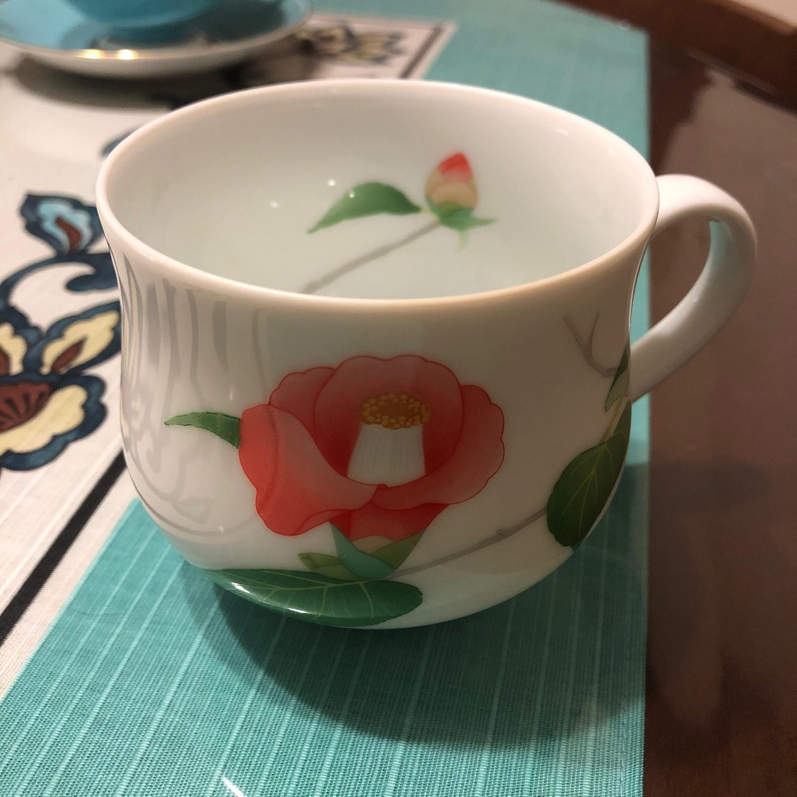

# お気に入りティーカップ

街角の喫茶店でイケオジマスターの淹れた珈琲を味わうのも好き、でも家ではもっぱら紅茶です。 
お気に入りの紅茶カップを雑に紹介してみよう！

### Wedgwood Wild Strawberry

- みんな大好きウェッジウッドの定番。英国のカントリーライフに想いを馳せよう。

### Wedgwood Psyche

- 銀色のリボン柄がとっても可憐なプシュケ。自分へのクリスマスプレゼントに購入。

### Aynsley Pembroke Athens

- 頂きもののエインズレイ ペンブロックアセンズ。大胆なお花柄で華やか。

### 香蘭社 日々と椿

- ハウステンボスで買った有田焼マグカップ。椿の朱色がとっても鮮やかであったかい。

### ポーリッシュポタリー

- 裏に作者のスタンプが押してあります。重いんだけどかわいい。好き。

このPageは [喫茶好きゆる Advent Calendar 2018](https://adventar.org/calendars/3432) 第14日目の記事として書かれました。 
15日目は qt_fb さんです。お楽しみに！
